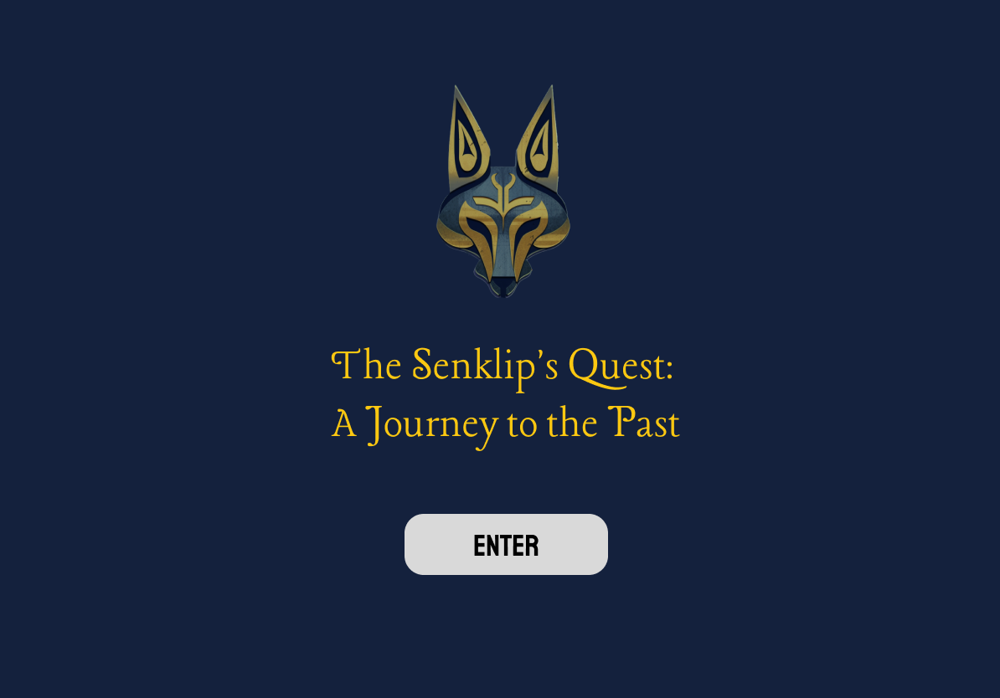

# IMTC505 project - Senklip's Quest

### Description:
This is a course project for IMTC505 Immersive Technology. It is an AR app which serves as an introduction of the history of the land that UBC-Okanagan campus is situated. Players discovers and learns the background of landmarks that has stories from the Syllix Okanagan through a guided tour.  

The presentation and demo can be found here (demo is from 1'15'' to 4'20''):[presentation](https://drive.google.com/file/d/10HgUXIq7C9POH8SvBafEUQMPkWDAoenE/view?usp=sharing)

### Introduction 
Our objective is to introduce a visitor to the history of the land the university is situated on and promote the culture (especially the language & music) of the Syllix Okanagan through a guided tour and a gamified experience. 

The game begins with the player, a new visitor arriving UBC Okanagan campus and is taking a personal tour of the campus. At the start of the game, they will be greeted by a NPC called Senklip (sen’k’lip, meaning coyotee). Senklip will give the player instructions to hunt for valued objects that depicts the relationship of okanagan nation as they interact with each object. When players interact with each object around the campus, there will be pop-up windows giving a brief background about the object. 

### Installation:
Download and install the apk file. Enables location and camera access while using the appp [download here](https://drive.google.com/file/d/16eQjCrbZk0zJMMtO_FBmS2biAY1-gXwN/view?usp=sharing).
Note: This app only works on Android devices.

### References: 

This unity project uses a RoadmapAuthoring template setup. Details could be found here: [RoadmapAuthoring](https://github.com/ovi-lab/RoadmapAuthoring) package, which allows authoring AR applications in both AR & VR, where the setup is synchrnoinzed through a cloud server. For the documentation visit [Roadmap Documentation](https://ovi-lab.github.io/RoadmapAuthoring)

###### Background information
Coyote story [link](https://www.firstvoices.com/explore/FV/sections/Data/nsyilxc%C9%99n/nsyilxc%C9%99n/Syilx).   
Road sign [link](https://ok.ubc.ca/about/indigenous-engagement/)  

###### Audio
*The Okanagan Song* [link](https://www.syilx.org/about-us/syilx-nation/songs/).  
Bear Sound [link](https://quicksounds.com/sound/2736/large-black-bear-processed-roar-and-growl)  

###### Models
All models are licensed under [Creative Commons Attribution](http://creativecommons.org/licenses/by/4.0/). 
[Coyote](https://skfb.ly/oIqpp) by alitural  
[Grizzly Bear](https://skfb.ly/orD8J) by freddy1231  
[Muscial Note](https://skfb.ly/o9CBJ) by plaggy  

### Contribution 
Development, documentation: Parinda Rahman, Yuzi Chu  
Content design: Michelle Yang  

